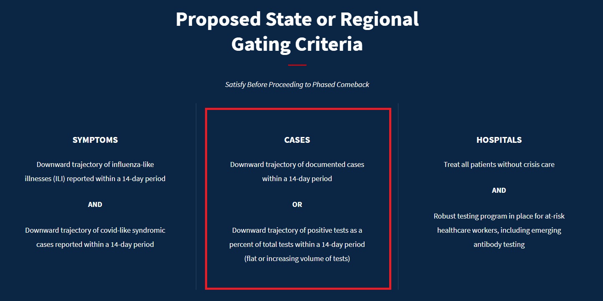

# Two-week trajectory for each state

Run file `testing.R` to build color-coded maps of every state to quickly evaluate whether states meet the White House's "Cases" criterion for reopening. You'll need an API key for the census bureau to render the maps. 

### White house guidelines

### Trajectories of documented cases

### Trajectories of positive tests as a percentage of total tests

#### Testing volume must be flat or increasing 

